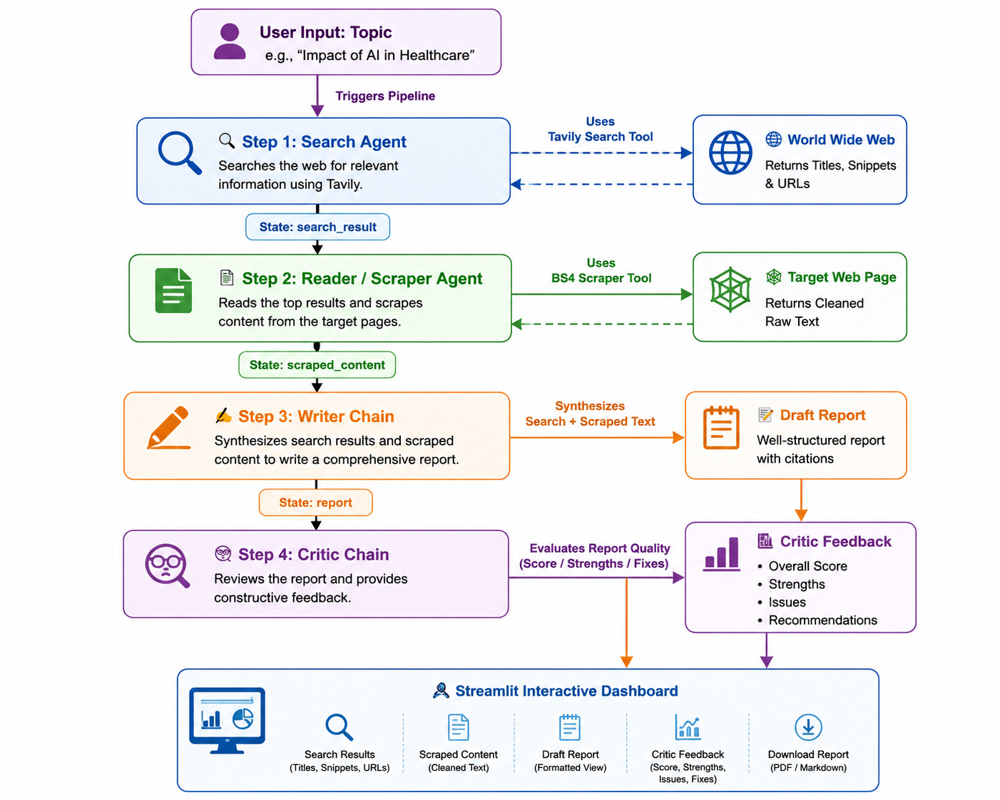

# ResearchMind: Multi-Agent AI Research System

An advanced, production-grade automated research pipeline powered by a collaborative multi-agent architecture. The system orchestrates multiple specialized LLM agents and semantic tools to perform deep web search, content scraping, synthesis writing, and critical quality reviews in a unified, reactive dashboard.

---

## 🎬 Live System Walkthrough

 Visit https://multi-agent-project-vjngzkvfktftdvgazw6dtj.streamlit.app/ to access this multi-agent in your browser

---

## 🏗️ Architecture & System Topology

The system is built on a **Sequential Multi-Agent Pipeline** architecture. Instead of a single LLM trying to search, read, write, and critique in one pass (which leads to hallucination and poor depth), **ResearchMind** splits these concerns into specialized agents and chains that execute sequentially, passing state through a structured schema.

### System Architecture Diagram



## ⚡ The Agent & Chain Lineup

### 1. 🔍 The Search Agent
*   **Type**: Tool-calling ReAct Agent (`langchain.agents.create_agent`).
*   **Role**: Formulates optimized search queries based on the user's research topic.
*   **Tooling**: Integrates with a Tavily Search API wrapper (`scrape_website`) to retrieve the top 5 highly relevant web results, including URLs, page titles, and snippets.
*   **System Prompt Focus**: High-precision discovery of credible references.

### 2. 📄 The Reader / Scraper Agent
*   **Type**: Tool-calling ReAct Agent (`langchain.agents.create_agent`).
*   **Role**: Analyzes the search results, identifies the single most promising resource, and scrapes its full contents.
*   **Tooling**: Utilizes a BeautifulSoup4/Requests tool (`scrape_url`) configured with custom headers to bypass scraping blocks, strip out boilerplate HTML components (like footers, scripts, and navigation menus), and return clean text context.
*   **State Impact**: Enriches the search snippets with up to 3,000 characters of deep source text.

### 3. ✍️ The Writer Chain
*   **Type**: LangChain Expression Language (LCEL) Chain (`writer_prompt | llm | StrOutputParser()`).
*   **Role**: Acts as an expert research writer. Combines the high-level snippets from the Search Agent and the deep text context from the Reader Agent to produce a cohesive, professional research report.
*   **Prompt Architecture**: Enforces a strict, professional structure:
    *   *Introduction*
    *   *Key Findings* (minimum 3 well-explained points)
    *   *Conclusion*
    *   *Sources* (listing all references)

### 4. 🧐 The Critic Chain
*   **Type**: LCEL Chain (`critic_prompt | llm | StrOutputParser()`).
*   **Role**: Conducts a cold, objective review of the generated report.
*   **Output Schema**: Enforces a standardized feedback structure:
    *   *Score*: X/10
    *   *Strengths*: Bulleted achievements.
    *   *Areas to Improve*: Critiques regarding clarity or omissions.
    *   *One-line Verdict*: Final summary of utility.

---

## 🛠️ Data Flow & State Management

State is passed down the pipeline using a centralized state dictionary. This ensures data isolation and easy debugging of individual steps:

```python
state = {
    "search_result": str,     # Snippets & links from Step 1
    "scraped_content": str,   # Clean text from deep scraping in Step 2
    "report": str,            # Generated markdown draft from Step 3
    "feedback": str           # Evaluation and score from Step 4
}
```

---

## 🧠 LLM Integration & Extensibility

*   **Model Provider**: Mistral AI (utilizing `langchain-openai` compatibility layer via `ChatOpenAI`).
*   **Core Model**: `mistral-small-latest` (balanced for speed, reasoning, and strict tool execution).
*   **OpenAI-Compatible base**: Dynamically swaps API endpoints and keys based on availability of environmental variables, allowing the system to run seamlessly on Mistral, OpenAI, or local engines like Ollama.

---

## 🖥️ UI/UX Design System (Streamlit)

The application features a tailored **Streamlit Theme** modified using custom CSS overrides:
*   **Branding & Typography**: Custom layout with a modern dark red and charcoal color theme (`#c62828`). Font stack uses `Poppins` for a clean interface.
*   **Responsive Timeline**: Custom-styled progress cards (`step_card`) indicate state changes (`WAITING` ➔ `● RUNNING` ➔ `✓ DONE`) as agents report in.
*   **Markdown Layout overrides**: Styles native Streamlit markdown components, rendering headers in crimson and body copy in clean off-black, preventing nested layout overflows.
*   **Export Actions**: Standardized download module supporting markdown outputs.

---

## 🚀 Running the Project locally

### 1. Prerequisites
Ensure you have Python 3.10+ installed.

### 2. Environment Configurations
Create a `.env` file in the root directory:
```env
TAVILY_API_KEY=your-tavily-api-key
MISTRAL_API_KEY=your-mistral-api-key
# Optional: Swap with OpenAI
# OPENAI_API_KEY=your-openai-api-key
# OPENAI_API_BASE=https://api.openai.com/v1
```

### 3. Installation
```bash
# Initialize Virtual Environment
python -m venv .venv
Source .venv/Scripts/activate # On Windows

# Install packages
pip install -r requirements.txt
```

### 4. Running the Dashboard
```bash
streamlit run app.py
```
